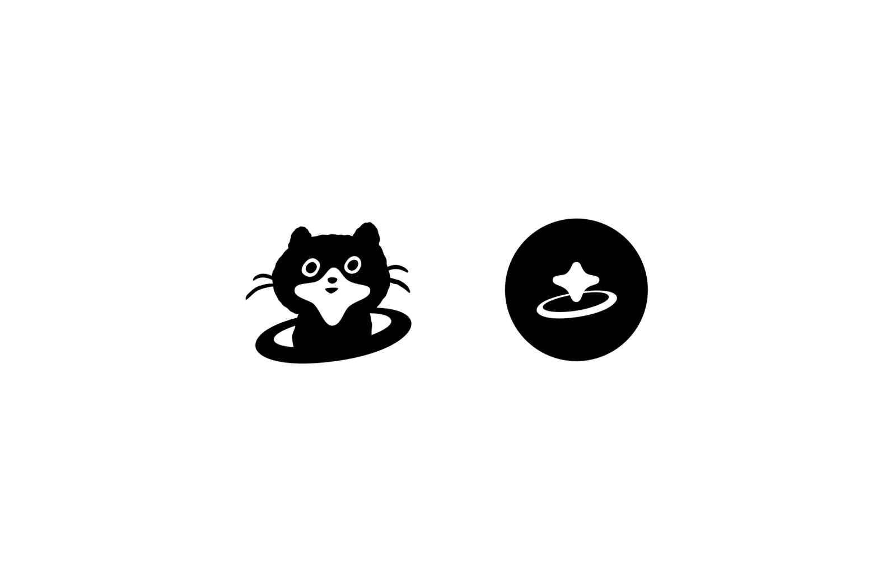

Visual identity for Hackers' Pub
================================

This repository contains the visual identity assets for [Hackers' Pub], such as
logos, favicons, and other related vector graphics.  The assets consist of
two formats:

 -  *hackerspub.ai*: Adobe Illustrator file containing the vector graphics
 -  *hackerspub.svg*: Inkscape SVG file containing the vector graphics,
    which can be used in web applications and other software

[Hackers' Pub]: https://hackers.pub/

Design concept
--------------

The visual identity embodies the spirit of the fediverse and hacker culture
through several symbolic elements:

 -  *Cat motif*: Represents the curious and independent nature of developers and
    hackers, who have long embraced cats as their cultural mascot
 -  *Star-shaped mouth*: Symbolizes the fediverse (federated universe) concept,
    reflecting ActivityPub's decentralized network topology
 -  *Orbital ring*: The circular element around the cat's neck evokes cosmic
    imagery, reinforcing the "universe" theme while suggesting connectivity and
    orbital dynamics
 -  *Minimalist design*: Clean geometric forms ensure versatility across
    platforms while maintaining strong brand recognition

The design captures the essence of a developer community that values
exploration, curiosity, and interconnectedness within the decentralized web.

Attribution
-----------

The visual identity was designed by [Bak Eunji].  Thanks to Bak Eunji for
creating this beautiful design!

[Bak Eunji]: mailto:bakeunji.design@gmail.com

Copyright and license
---------------------

Visual Identity of Hackers' Pub © 2025 by Bak Eunji is licensed under
[Creative Commons Attribution-ShareAlike 4.0 International][CC-BY-SA 4.0].

[CC-BY-SA 4.0]: https://creativecommons.org/licenses/by-sa/4.0/
